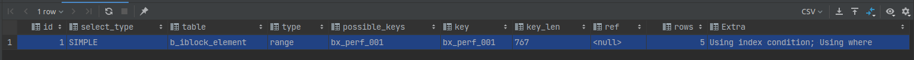

## Первичный ключ

### Лучше всегда иметь `PRIMARY KEY` в таблице

В большинстве случаев для таблиц InnoDB в MySQL лучше всего добавлять первичный ключ (индекс) по числовому полю.
Это упростит работу с таблицей и позволит обращаться к записям по ключам. Наличие первичного числового индекса, также ускоряет работу репликации MySQL, при изменении или удаление больших
объемов данных.
К тому же, если вы не создадите `PRIMARY KEY ` MySQL создаст его сам, но у вас не будет доступа к нему.

Использование  bigint(20) unsigned предпочтительно.

```sql
CREATE TABLE `b_bx24_url` (
	`ID` bigint(20) unsigned NOT NULL AUTO_INCREMENT,
	`DATE_CREATE` timestamp NOT NULL DEFAULT CURRENT_TIMESTAMP,
	`URL` varchar(255) COLLATE utf8_unicode_ci NOT NULL DEFAULT '',
	PRIMARY KEY (`ID`),
	UNIQUE KEY `UX_DBNAME` (`URL`)
) ENGINE=InnoDB AUTO_INCREMENT=20342 DEFAULT CHARSET=utf8 COLLATE=utf8_unicode_ci
```

`поведение репликации может меняться в зависимости от настроек`

Ускорение работы репликации происходит за счет того, что будут переданы ID записей которые надо удалить или изменить.
Что естественно ускорит выполнение запроса на ней, если же не будет первичного ключа, то на реплике будет
выполняться запрос для каждой записи при для ее удаления или изменения. В результате чего, запрос может сильно замедлиться.

Использование составных первичных ключей, так же может быть не актуально в данном случае. Так как запрос на удаление
может не содержать всех полей ключа.

### Добавление `PRIMARY KEY` в составные индексы

При использовании таблиц InnoDB, не надо добавлять `PRIMARY KEY` в конец составного индекса.

```sql
KEY `UX_DBNAME` (`URL`, `ID`)
```
Так как InnoDB в конец каждого индекса добавляет ссылку на первичный индекс и приведенный выше индекс превращается в

```sql
KEY `UX_DBNAME` (`URL`, `ID`, `ID`)
```

## Общие рекомендации по индексам

### Индекс по строковым полям
При создании индексов для полей типа `TEXT` или `VARCHAR` может потребоваться ограничение длины индекса для поля.
```sql
KEY `UX_DBNAME` (`URL` (32))
```
Такое ограничение будет полезным если у вас в поле может сохраняться значительно больше символов, чем основная масса значений.
Ограничив таким образом индекс, значительно повысим его эффективность за счет уменьшения размера.

Также стоит обратить внимание на фильтрацию по большим значениям. Например, у есть колонка `service_id` значение 
в которой может быть до 1000 символов. В этом случае для быстрой фильтрации по значению этого поля лучше сохранит хеш 
от него, и добавить индекс именно на это поле с хешем. Это уменьшит размер индекса и повысит эффективность его использования.

### Работа с составными индексами

Порядок колонок в составном индексе важен и влияет на его работу. Рассмотрим на примере индекса.

```sql
KEY `IX_SOME_KEY` (`A`, `B`, `C`)
```

Индекс будет использоваться полностью в запросах:
```sql
A > 9
A = 9 AND B > 6
A = 9 AND B = 15 AND C = 11
A = 9 AND B IN (2,3) AND C > 3
```

Индекс будет использоваться частично:
```sql
A > 9 AND B = 6 -- будет использоваться только диапазон по первой колонке индекса
A = 9 AND B > 15 AND C = 11 -- будет использоваться первая колонка и диапазон по второй
```

Индекс не будет использоваться:
```sql
B > 6 -- в запросе нету первой колонки индекса
B = 15 AND C > 11 -- в запросе нету первой колонки индекса
```

MySQL будет использовать индекс, до тех пор пока ему в фильтре не встретится колонка с диапазоном (>, <, BETWEEN).
Эта колонка будет последней используемой колонкой из индекса. MySQL сможет продолжить использовать колонки из индекса, 
если встретит диапазон IN (). 

Таким образом при проектировании составного индекса, необходимо учитывать поля фильтра 
и операции над ними. Ставя на первое место те, которые есть в наибольшем количестве возможных фильтров. При прочих 
равных на первое место стоит выбирать наиболее селективные колонки.

### Индексы и сортировка

Добавление индекса позволяет ускорить сортировку. Так для запроса 

```sql
SELECT * FROM b_iblock_element ORDER BY SORT DESC LIMIT 10;
```
Хорошо подойдет индекс приведенный ниже. Если же его не будет, то MySQL начнет выполнять запрос с внешней сортировкой 
(filesort). Что достаточно дорого и медленно.
```sql
KEY `IX_SORT` (`SORT`)
```

Для ускорения запроса с фильтрацией и сортировкой, может использоваться составной индекс.
```sql
SELECT * FROM b_iblock_element WHERE IBLOCK_ID = 3 ORDER BY SORT DESC LIMIT 10;
KEY `IX_IBLOCK_SORT` (`IBLOCK_ID`, `SORT`)
```

Примеры работы составного индекса с сортировкой

```sql
KEY IX_KEY (`A`, `B`)
```
Индекс **будет** использоваться для сортировки
```sql
ORDER BY A -- сортировка по первой колонке индекса
A = 9 ORDER BY B -- фильтрация по первой колонке и сортировка по второй
ORDER BY A DESC, B DESC -- сортировка по двум колонкам, в одном направление
A > 9 ORDER BY A DESC -- диапазон и сортировка по первой колонке
```

Индекс **не будет** использоваться для сортировки 
```sql
ORDER BY B -- сортировка по второй колонке индекса
A > 9 ORDER BY B DESC -- диапазон по первой, сортировка по второй
A IN (3,4) ORDER BY B -- in диапазон по первой колонке
ORDER BY A ASC, B DESC -- сортировка по двум колонкам, в разных направлениях
```

### Join и индексы

MySQL использует в основном алгоритм Nested Loops для джоина таблиц. 

```sql
SELECT * FROM POSTS, COMMENTS WHERE AUTHOR = 15 AND COMMENTS.POST_ID = POSTS.ID
```
Так, при выполнение данного запроса БД вначале пробежит по таблице POSTS и найдет записи с автором 15. 
И для каждой найденной записи сделает полную переборку таблицы COMMENTS, что бы присоединить комментарии. Таким образом 
самым дорогим тут будет поиск по таблице комментариев. И с ростом постов и комментариев запрос будет деградировать.

Поэтому для все запросов с Join необходимо создавать индексы в присоединяемых таблицах по тем полям по которым идет 
объединение.

Для запроса выше, это будет 
```sql

ALTER TABLE COMMENTS ADD INDEX IX_POST_ID (POST_ID); -- обязательный индекс для Join 
ALTER TABLE POSTS ADD INDEX ID_AUTHOR (AUTHOR); -- индекс для ускорения фильтрации авторов в первой таблице.
```
При этом индекс по POSTS.ID в данном случае, для ускорения запросов, не нужен. Но при Join может произойти перекос 
данных и MySQL начнет фильтровать вначале по таблице из Join, а потом уже по основной. В этом случае необходим индекс и 
в обратную сторону.


### Explain запросов

Для того, что бы определить как будет выполнятся запрос и найти причины его медленного выполнения можно существует 
команда EXPLAIN. Рассмотрим ее работу на примере простого запроса.

Таблица
```sql
CREATE TABLE `b_iblock_element` (
  `ID` int(11) NOT NULL AUTO_INCREMENT,
  `IBLOCK_ID` int(11) NOT NULL DEFAULT '0',
  `IBLOCK_SECTION_ID` int(11) DEFAULT NULL,
  `SORT` int(11) NOT NULL DEFAULT '500',
  `NAME` varchar(255) COLLATE utf8_unicode_ci NOT NULL,
  `WF_PARENT_ELEMENT_ID` int(11) DEFAULT NULL,
  `XML_ID` varchar(255) COLLATE utf8_unicode_ci DEFAULT NULL,
  `CODE` varchar(255) COLLATE utf8_unicode_ci DEFAULT NULL,
  `WF_LAST_HISTORY_ID` int(11) DEFAULT NULL,
  `SHOW_COUNTER` int(18) DEFAULT NULL,
  `SHOW_COUNTER_START` datetime DEFAULT NULL,
  
  PRIMARY KEY (`ID`),
  KEY `ix_iblock_element_1` (`IBLOCK_ID`,`IBLOCK_SECTION_ID`),
  KEY `ix_iblock_element_4` (`IBLOCK_ID`,`XML_ID`,`WF_PARENT_ELEMENT_ID`),
  KEY `ix_iblock_element_3` (`WF_PARENT_ELEMENT_ID`),
  KEY `bx_perf_001` (`NAME`,`IBLOCK_ID`)
) ENGINE=InnoDB AUTO_INCREMENT=1318928 DEFAULT CHARSET=utf8 COLLATE=utf8_unicode_ci
```

```sql
EXPLAIN
SELECT * FROM b_iblock_element WHERE ACTIVE = 'Y' AND NAME LIKE 'rns%';
```
Выполнив, приведенный выше запрос, мы получим следующий результат

Где:
* selected_type - указывает тип выборки в запросе
* table - таблица по которой делалась выборка
* type - тип фильтрации, в данном случае диапазон
* possible_keys - возможные ключи, для данного запроса
* key - ключ выбранный оптимизатором, для выполнения запроса
* key_len - длина ключа
* ref - используемые ссылки при фильтрации на значения других таблиц
* rows - количество строк, которые перебрал mysql, при выполнении запроса (чем меньше тем лучше) 
* Extra - дополнительная информация по плану выполнения запроса

По приведенному эксплайну видно, что запрос в целом оптимальный, так как использовалось всего 5 строк и использовался 
индекс. Но если посмотреть на колонку Extra видно, что помимо индекса, полученный диапазон перебирался построчно 
и применялся фильтр. Таким образом при определенном наборе данных запрос может оказаться не эффективным.

Для более детального же понимания происходящего, лучше использовать explain в json формате.

```sql
EXPLAIN format = json
SELECT * FROM b_iblock_element WHERE ACTIVE = 'Y' AND NAME LIKE 'rns%';
```
В этом случае мы получим, следующий результат
```json
{
  "query_block": {
    "select_id": 1,
    "table": {
      "table_name": "b_iblock_element",
      "access_type": "range",
      "possible_keys": ["bx_perf_001"],
      "key": "bx_perf_001",
      "key_length": "767",
      "used_key_parts": ["NAME"],
      "rows": 5,
      "filtered": 100,
      "index_condition": "(b_iblock_element.`NAME` like 'rns%')",
      "attached_condition": "(b_iblock_element.ACTIVE = 'Y')"
    }
  }
}
```
По которому видно, что из составного индекса использовалось только одно поле `NAME`. А дальше, полученный диапазон 
построчно сравнивался с условием `(b_iblock_element.ACTIVE = 'Y')`.