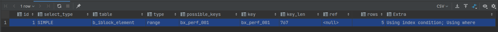

## Интепритация explain запросов

Для разбора плана выполнения запросов и выявления проблем в MySQL существует команда EXPLAIN. Ее работу рассмотрим на 
примере.

Таблица
```sql
CREATE TABLE `b_iblock_element` (
  `ID` int(11) NOT NULL AUTO_INCREMENT,
  `IBLOCK_ID` int(11) NOT NULL DEFAULT '0',
  `IBLOCK_SECTION_ID` int(11) DEFAULT NULL,
  `SORT` int(11) NOT NULL DEFAULT '500',
  `NAME` varchar(255) COLLATE utf8_unicode_ci NOT NULL,
  `WF_PARENT_ELEMENT_ID` int(11) DEFAULT NULL,
  `XML_ID` varchar(255) COLLATE utf8_unicode_ci DEFAULT NULL,
  `CODE` varchar(255) COLLATE utf8_unicode_ci DEFAULT NULL,
  `WF_LAST_HISTORY_ID` int(11) DEFAULT NULL,
  `SHOW_COUNTER` int(18) DEFAULT NULL,
  `SHOW_COUNTER_START` datetime DEFAULT NULL,
  
  PRIMARY KEY (`ID`),
  KEY `ix_iblock_element_1` (`IBLOCK_ID`,`IBLOCK_SECTION_ID`),
  KEY `ix_iblock_element_4` (`IBLOCK_ID`,`XML_ID`,`WF_PARENT_ELEMENT_ID`),
  KEY `ix_iblock_element_3` (`WF_PARENT_ELEMENT_ID`),
  KEY `bx_perf_001` (`NAME`,`IBLOCK_ID`)
) ENGINE=InnoDB AUTO_INCREMENT=1318928 DEFAULT CHARSET=utf8 COLLATE=utf8_unicode_ci
```

```sql
EXPLAIN
SELECT * FROM b_iblock_element WHERE ACTIVE = 'Y' AND NAME LIKE 'rns%';
```
Выполнив, приведенный выше запрос, мы получим следующий результат


#### selected_type тип выборки в запросе

Показывает тип запроса SELECT для каждой строки результата EXPLAIN. Если запрос простой и не содержит подзапросов или
объединений, то в столбце будет значение `SIMPLE`. Иначе, самый верхний запрос помечается как `PRIMARY`, а остальные 
следующим образом:

* `SUBQUERY` запрос `SELECT`, который содержится в подзапросе, находящимся в разделе SELECT (т.е. не в разделе FROM).

* `DERIVED` обозначает производную таблицу, являющуюся подзапросом в разделе `FROM`. Выполняется рекурсивно и 
помещается во временную таблицу, на которую сервер ссылается по имени `derived table`.

* `UNION` если присутствует объединение `UNION`, то первый входящий в него запрос считается частью внешнего запроса и
помечается как `PRIMARY`. Если бы объединение `UNION` было частью подзапроса в разделе `FROM`, то его первый запрос `SELECT`
был бы помечен как `DERIVED`. Второй и последующий запросы помечаются как `UNION`.

* `UNION RESULT` показывает результата запроса `SELECT`, который сервер MySQL применяет для чтения из временной таблицы,
созданной в результате объединения `UNION`.

* `DEPENDENT` данным типом могут быть помечены `SUBQUERY`, `UNION` и `DERIVED`, то есть результат запроса зависит от данных,
внешнего запроса.

* `MATERIALIZED` использование временной таблицы для результатов работы подзапросов в [NOT] IN, позволяет выполнять
подзапрос только один раз, для всех строк внешнего запроса.

* `UNCACHEABLE SUBQUERY` | `UNCACHEABLE UNION` подзапрос не может быть кеширован и должен исполняться для каждой строки


####table - таблица используемая в выборке

####type - тип объединения таблиц
Показывает тип используемого объединения таблиц, ниже приведен список типы соединений, упорядоченные от наилучшего типа 
к худшему:

* `system` таблица содержит только одну строку (= системная таблица). Частный случай типа `const join`.
* `const` таблица содержит не более одной совпадающей строки. Поэтому значения столбца из строки этой таблицы, могут 
рассматриваться остальной частью оптимизатора как константы. Данный тип объединения работает очень быстро, так как 
данные считываются только один раз.
`const` используется, при сравнение `PRIMARY KEY` или `UNIQUE INDEX` с постоянным значением.
```sql
SELECT * FROM table WHERE PRIMARY_KEY = 1;

SELECT * FROM table WHERE PRIMARY_KEY_PART1 = 1 AND PRIMARY_KEY_PART2 = 2;
```
* `eq_ref` для каждой комбинации строк из предыдущих таблиц считывается одна строка. Получается при полном попадание в
`PRIMARY_KEY` или не нулевой `UNIQUE KEY`.

может использоваться для индексированных столбцов, которые сравниваются с помощью оператора =. Значение сравнения может быть константой или выражением, использующим столбцы из таблиц, которые считываются перед этой таблицей. В следующих примерах MySQL может использовать соединение eq_ref для обработки ref_table:


* 
* possible_keys - возможные ключи, для данного запроса
* key - ключ выбранный оптимизатором, для выполнения запроса
* key_len - длина ключа
* ref - используемые ссылки при фильтрации на значения других таблиц
* rows - количество строк, которые перебрал mysql, при выполнении запроса (чем меньше тем лучше)
* Extra - дополнительная информация по плану выполнения запроса

По приведенному эксплайну видно, что запрос в целом оптимальный, так как использовалось всего 5 строк и использовался
индекс. Но если посмотреть на колонку Extra видно, что помимо индекса, полученный диапазон перебирался построчно
и применялся фильтр. Таким образом при определенном наборе данных запрос может оказаться не эффективным.

Для более детального же понимания происходящего, лучше использовать explain в json формате.

```sql
EXPLAIN format = json
SELECT * FROM b_iblock_element WHERE ACTIVE = 'Y' AND NAME LIKE 'rns%';
```
В этом случае мы получим, следующий результат
```json
{
  "query_block": {
    "select_id": 1,
    "table": {
      "table_name": "b_iblock_element",
      "access_type": "range",
      "possible_keys": ["bx_perf_001"],
      "key": "bx_perf_001",
      "key_length": "767",
      "used_key_parts": ["NAME"],
      "rows": 5,
      "filtered": 100,
      "index_condition": "(b_iblock_element.`NAME` like 'rns%')",
      "attached_condition": "(b_iblock_element.ACTIVE = 'Y')"
    }
  }
}
```
По которому видно, что из составного индекса использовалось только одно поле `NAME`. А дальше, полученный диапазон
построчно сравнивался с условием `(b_iblock_element.ACTIVE = 'Y')`.